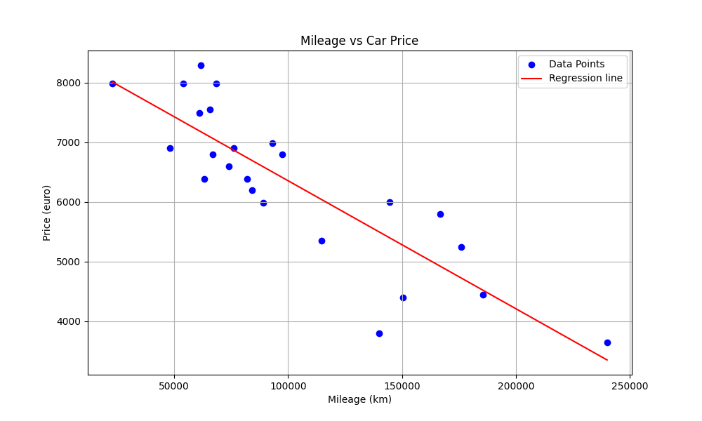
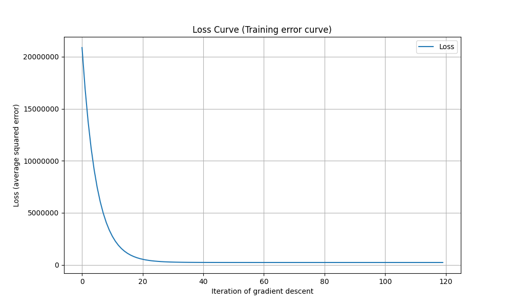

*This project has been created as part of the 42 curriculum by irkalini.*

# ft_linear_regression

## Description

This project introduces the fundamentals of Machine Learning through a simple Linear Regression model.

The goal is to predict the price of a car based on its mileage using Gradient Descent. The model learns the best regression line from a dataset and then uses it to estimate prices for new mileage values.



---

## Instructions

### Train the model:

```bash
make train
```

Example output:

```text
theta0: 8499.567017717669, theta1: -0.0214488430255591
Precision (R**2): 0.73
```
Meaning:

* `theta0` → line intercept
* `theta1` → line slope
* `R²` → model accuracy

After training, the model generates:
- regression graph (`graphs/graph.png`)
- loss curve (`graphs/loss.png`)

### Run prediction:

```bash
make predict
```

Example output:

```text
Enter mileage: 50000
Estimated price:  7427.1248664397135
```

The file `graphs/graph.png` is regenerated with the predicted value shown on the graph.

### Clean generated files

```bash
make clean
```

Removes generated graphs.

### Full cleanup

```bash
make fclean
```

Removes:
- generated graphs
- saved model (`data/thetas.json`)
- virtual environment (`.venv`)

---

# Mathematical Background

## Normalization

Before training the model, the mileage values are normalized.

In the dataset, mileage values can be very large:

```text
km = 240000
price = 4000
```

The difference in scale between mileage and price can make Gradient Descent slower and less stable.

To avoid this problem, the mileage values are transformed using:

```text
X_norm = (X - mean(X)) / std(X)
```

After normalization, the values are centered around 0 and usually fall within a much smaller range.

Example:

```text
Original km values:
[50000, 100000, 150000]

Normalized values:
[-1.22, 0.00, 1.22]
```

This allows Gradient Descent to converge faster and makes the parameter updates more consistent during training.

Once training is finished, the parameters are converted back to the original scale so that predictions can be made using real mileage values.

---

## Goal of the Best-Fit Line

Linear Regression tries to find the line that best represents the relationship between mileage and price.

The regression line is defined by:

**y = theta_0 + theta_1 * x**

Where:

* x = mileage
* y = predicted price
* theta_0 = intercept
* theta_1 = slope

Example:

<p align="center">
    
</p>

The objective is to find the values of `theta_0` and `theta_1` that produce the **best possible line**.

---

## Measuring Error: Mean Squared Error (MSE)

To know whether a line is good or bad, we measure its error.

For each point:

**error = prediction - actual_value**

The Mean Squared Error is:

MSE = (1 / m) * Σ (prediction - y)^2

The square prevents positive and negative errors from cancelling each other.

A smaller MSE means a better model.

---

## Cost Function

Instead of directly minimizing the MSE, Linear Regression usually uses the Cost Function:

**J(theta) = (1 / (2m)) * Σ (prediction - y)^2**

This is simply the MSE multiplied by (1/2).

The factor (1/2) simplifies the derivatives used during Gradient Descent.

The objective of training is to **minimize the Cost Function** J(theta).

---

## Derivatives

To know how to improve the line, we compute the derivatives of the Cost Function.

Derivative with respect to `theta_0`:

**∂J/∂theta0 = (1 / m) * Σ (prediction - y)**

Derivative with respect to `theta_1`:

**∂J/∂theta1 = (1 / m) * Σ((prediction - y) * x)**

These derivatives form the **gradient** of the Cost Function.

The gradient indicates the direction in which the parameters should move to reduce the Cost Function.

---

## Gradient Descent

Gradient Descent is an optimization algorithm used to minimize the Cost Function.

At each iteration:

**theta0 = theta0 - α * (∂J/∂theta0)**

**theta1 = theta1 - α * (∂J/∂theta1)**

Where:

* α (alpha) = learning rate

The gradient points toward increasing cost, so we subtract it to move toward lower cost.

At each iteration, the regression line gets closer to the best-fit line and the Cost Function becomes smaller.

This process is repeated until the parameters converge to values that minimize the Cost Function.

---

## Loss Curve

During training, the Cost Function is recorded at each iteration.

Example:

<p align="center">
    
</p>

The graph shows:

* X-axis → iterations
* Y-axis → loss value

A decreasing curve indicates that the model is learning correctly.

---

## Regression Line

After training, the model produces a regression line.

Example:

<p align="center">
    
</p>

The blue points represent the dataset.

The red line represents the predictions produced by the model.

---

## Coefficient of Determination (R²)

R² measures how well the regression line explains the data.

First:

```text
SSres = Σ(y - y_pred)^2
```

Residual Sum of Squares.

It measures the variation that is not explained by the model.

Then:

```text
SStot = Σ(y - mean(y))^2
```

Total Sum of Squares.

It measures the total variation present in the dataset.

Finally:

```text
R² = 1 - (SSres / SStot)
```

Interpretation:

* `R² = 1` → perfect predictions
* `R² = 0` → predicts no better than the mean
* `R² < 0` → worse than predicting the mean

The closer R² is to 1, the better the regression line fits the data.

---

## Resources

### Technologies

* Python
* NumPy
* Pandas
* Matplotlib

### Articles & Tutorials

* GeeksForGeeks — [Linear Regression in Machine learning](https://www.geeksforgeeks.org/machine-learning/ml-linear-regression/)
* WikipediA - [Gradient descent](https://en.wikipedia.org/wiki/Gradient_descent)
* MATLAB - [What Is a Linear Regression Model?](https://www.mathworks.com/help/stats/what-is-linear-regression.html)
* GeeksForGeeks - [Gradient Descent in Linear Regression](https://www.geeksforgeeks.org/machine-learning/gradient-descent-in-linear-regression/)

### AI Usage

AI was used to:

* Explain the mathematical concepts behind Linear Regression.
* Review the implementation of Gradient Descent.
* Verify formulas and derivations.
* Improve documentation and project presentation.

The final implementation, debugging, testing and project understanding were completed manually.
