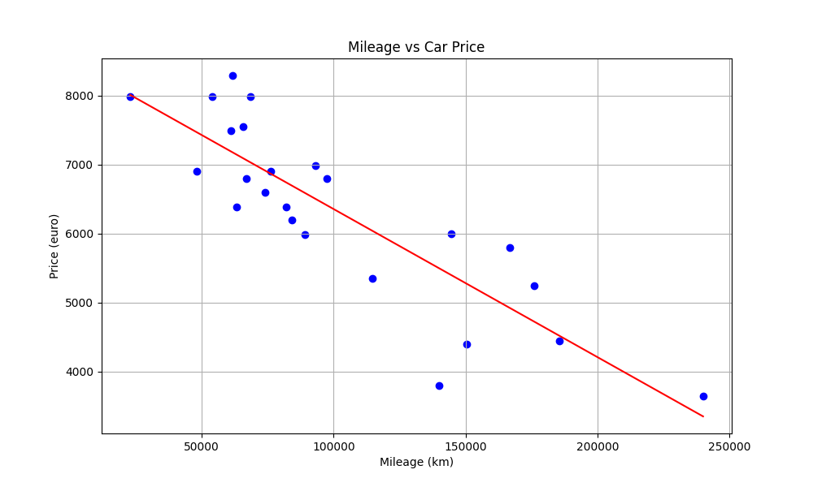
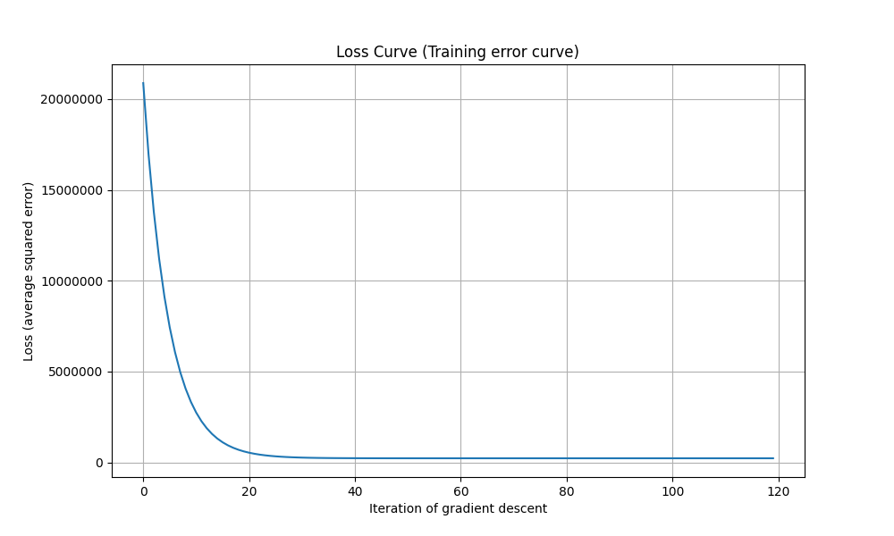

*This project has been created as part of the 42 curriculum by irkalini.*

# ft_linear_regression

## Description

This project introduces the fundamentals of Machine Learning through a simple Linear Regression model.

The goal is to predict the price of a car based on its mileage using Gradient Descent. The model learns the best regression line from a dataset and then uses it to estimate prices for new mileage values.



---

## Instructions

Run the project:

```bash
make
```

Clean generated graphs:

```bash
make clean
```

Example output:

```text
Enter mileage: 60000

theta0: 8499.567017717669
theta1: -0.0214488430255591

Precision (R²): 0.73

Estimated price: 7212.636436184123
```

Meaning:

* `theta0` → line intercept
* `theta1` → line slope
* `R²` → model accuracy
* `Estimated price` → predicted car price

Generated graphs:

* `graphs/graph.png` → regression line
* `graphs/loss.png` → loss curve

---

# Mathematical Background

## Goal of the Best-Fit Line

Linear Regression tries to find the line that best represents the relationship between mileage and price.

The regression line is defined by:

[
y = \theta_0 + \theta_1 x
]

Where:

* (x) = mileage
* (y) = predicted price
* (\theta_0) = intercept
* (\theta_1) = slope

Example:

<p align="center">
    
</p>

The objective is to find the values of (\theta_0) and (\theta_1) that produce the best possible line.

---

## Measuring Error: Mean Squared Error (MSE)

To know whether a line is good or bad, we measure its error.

For each point:

[
error = prediction - actual
]

The Mean Squared Error is:

[
MSE = \frac{1}{m}\sum_{i=1}^{m}(prediction_i - y_i)^2
]

The square prevents positive and negative errors from cancelling each other.

A smaller MSE means a better model.

---

## Cost Function

Instead of directly minimizing the MSE, Linear Regression usually uses the Cost Function:

[
J(\theta)=\frac{1}{2m}\sum_{i=1}^{m}(prediction_i-y_i)^2
]

This is simply the MSE multiplied by (1/2).

The factor (1/2) simplifies the derivatives used during Gradient Descent.

The objective of training is:

[
\min J(\theta)
]

---

## Derivatives

To know how to improve the line, we compute the derivatives of the Cost Function.

Derivative with respect to (\theta_0):

[
\frac{\partial J}{\partial \theta_0}
====================================

\frac{1}{m}
\sum(prediction-y)
]

Derivative with respect to (\theta_1):

[
\frac{\partial J}{\partial \theta_1}
====================================

\frac{1}{m}
\sum(prediction-y)x
]

These derivatives indicate the direction in which the parameters should move.

---

## Gradient Descent

Gradient Descent is an optimization algorithm used to minimize the Cost Function.

At each iteration:

[
\theta_0 := \theta_0 - \alpha \frac{\partial J}{\partial \theta_0}
]

[
\theta_1 := \theta_1 - \alpha \frac{\partial J}{\partial \theta_1}
]

Where:

* (\alpha) = learning rate

The process is repeated many times until the Cost Function becomes small.

---

## Loss Curve

During training, the Cost Function is recorded at each iteration.

Example:

<p align="center">
    
</p>

The graph shows:

* X-axis → iterations
* Y-axis → loss value

A decreasing curve indicates that the model is learning correctly.

---

## Regression Line

After training, the model produces a regression line.

Example:

<p align="center">
    
</p>

The blue points represent the dataset.

The red line represents the predictions produced by the model.

---

## Coefficient of Determination (R²)

R² measures how well the regression line explains the data.

First:

[
SS_{res}
========

\sum(y-\hat y)^2
]

Residual Sum of Squares.

Then:

[
SS_{tot}
========

\sum(y-\bar y)^2
]

Total Sum of Squares.

Finally:

[
R^2
===

1-\frac{SS_{res}}{SS_{tot}}
]

Interpretation:

* (R^2 = 1) → perfect model
* (R^2 = 0) → predicts no better than the mean
* (R^2 < 0) → worse than predicting the mean

The closer R² is to 1, the better the model fits the data.

---

## Resources

### Documentation

* Python Documentation
* NumPy Documentation
* Pandas Documentation
* Matplotlib Documentation

### Articles & Tutorials

* GeeksForGeeks — Linear Regression
* Andrew Ng's Machine Learning Course
* StatQuest — Linear Regression
* 3Blue1Brown — Gradient Descent

### AI Usage

AI was used to:

* Explain the mathematical concepts behind Linear Regression.
* Review the implementation of Gradient Descent.
* Verify formulas and derivations.
* Improve documentation and project presentation.

The final implementation, debugging, testing and project understanding were completed manually.
